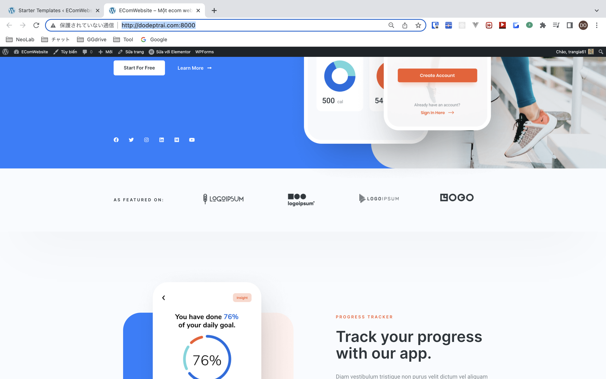
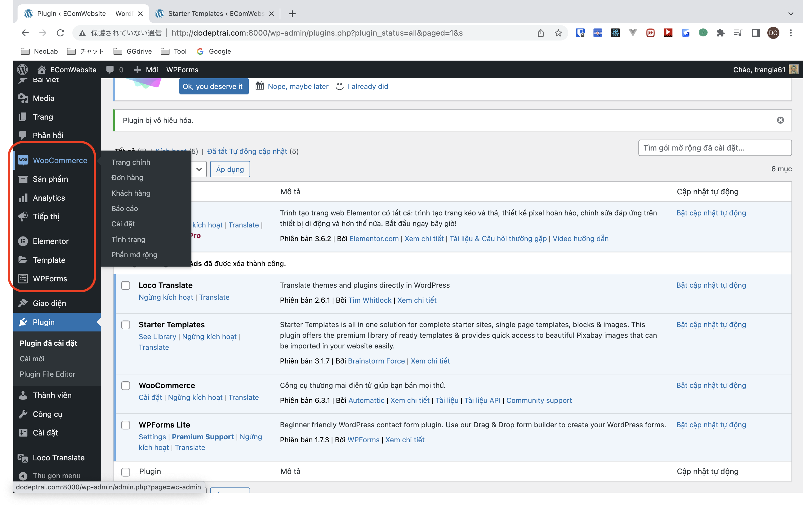
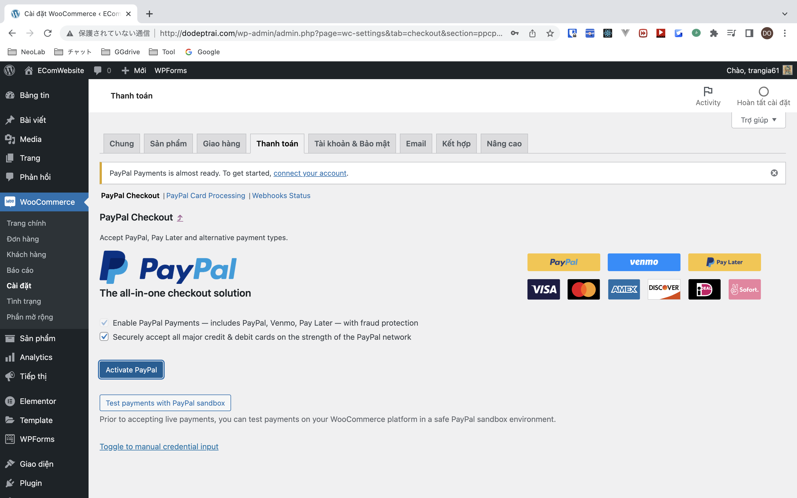

# php-wordpress-woocomerce-docker-compose


[](https://github.com/tquangdo/php-wordpress-woocomerce-docker-compose/issues/new)

# reference
[youtube](https://www.youtube.com/watch?v=adMfVptgVZo&t=12508s)

# install wordpress
```shell
docker-compose up -d --build
cat /etc/hosts | grep dodeptrai
=>
127.0.0.1       dodeptrai.com
```
- access `dodeptrai.com:8000` on browser => will auto redirect to install page

- after install wordpress, access `dodeptrai.com:8000` again

- update wordpress latest version=`5.9`

- access `dodeptrai.com:3001` on browser => will see `wordpress.wp_users`


# install elementor
[elementor](https://sinhgiang.com/elementor)


# install Loco Translate

# setting admin page
- menu `options > general`

1. ## astra
- install theme `astra`

- click `install plugin ...`(OR`Appearance > Starter Templates`) > select `elementor`

1. ### tech
    - select `online shop > tech start`
    
    - result after imported
    
1. ### cosmetics
    - search `cosmetics` > select template [cosmetics-store](https://websitedemos.net/cosmetics-store-02/)
    - result after imported
    
    --
    

# install woo
- `plugin > install new plugin > woo`

1. ## giao hang
    - setting `khu vuc giao hang > dong gia/mien phi`:
    - 1. setting
    
    - 2. result
    
    - setting `Loại hình giao hàng`
    
1. ## thanh toan
    - setting `Chuyển khoản ngân hàng`
    
    - setting `Trả tiền mặt khi nhận hàng`
    
    - setting `paypal`
    
1. ## email
    - click `Bấm vào đây để xem cách email hiển thị như nào.`
    

# Sản phẩm
1. ## đơn giản
    
1. ## biến thể
    - setting
    
    - result
    
1. ## nhóm
    - setting
    
    - result
    
1. ## liên kết
    - setting
    
    - result
    
1. ## ảo
    - setting
    
    - result
    
1. ## tải xuống
    - setting
    
    - result
    
